<h1 align="center">
  Hello there 
</h1>

  

  

---

### 🛠️ Tech Stack & Tools

  

---

### 📌 Featured Projects

| Project | Description | Links |
| :--- | :--- | :---: |
| **Pedemonte Digital Twin** | Digital twin modeling and simulation | [Repository](https://github.com/Frasquito3/PedemonteDigitalTwin_v2) |
| **SIGMA-LA** | Integrated platform and backend services | [Frontend](https://github.com/SIGMA-LA/Front-End-SIGMA-LA) / [Backend](https://github.com/SIGMA-LA/Back-End-SIGMA-LA) |
| **DSW App** | Comprehensive full-stack web application | [Frontend](https://github.com/upskill-team/Front-End-DSW) / [Backend](https://github.com/upskill-team/Back-End-DSW) |
| **AnyLogic Web Toolkit** | Web-based tools and utilities for AnyLogic | [Repository](https://github.com/NiconiKimg/AnyLogicWebToolkit) |

---

### 📊 GitHub Stats

  
  

---

### 📫 Connect with Me

  
  &nbsp;
  

